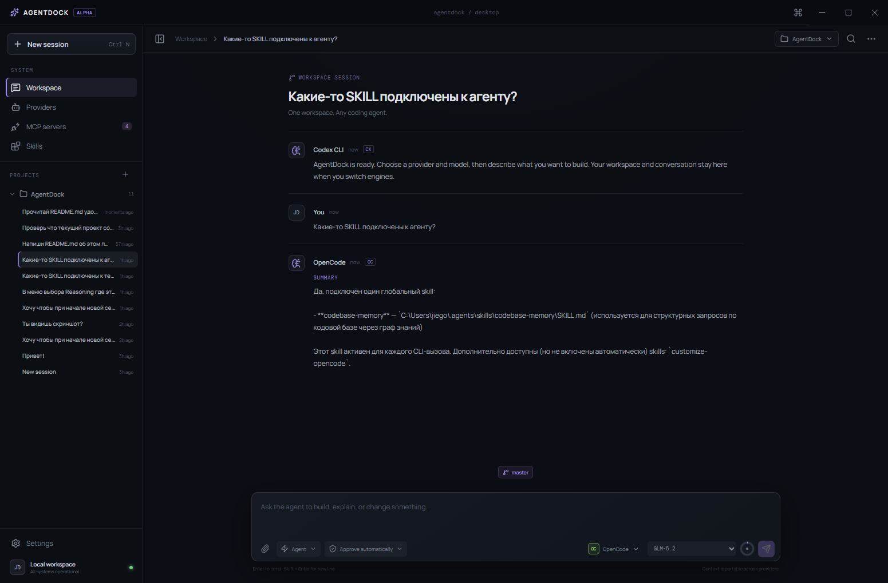

# AgentDock

**One workspace for Codex CLI, Claude Code, and OpenCode.**

AgentDock is a cross-platform Electron desktop app for working with multiple coding-agent CLIs from one interface. It keeps sessions organized by project, carries recent conversation context when you switch providers, and provides shared views for Skills, MCP servers, permissions, Git state, usage, and agent activity.



> AgentDock is currently at an early stage (`0.1.0`). It runs locally and uses the authentication and configuration of the installed CLIs.

## Why AgentDock

Coding-agent CLIs usually keep their own history, configuration, and workflows. AgentDock adds a provider-neutral workspace on top of them:

- **Switch providers without starting over.** Recent user and assistant messages, the active Git branch, and attachments are passed to the next CLI as continuation context.
- **Keep work project-oriented.** Sessions are stored locally and grouped by workspace rather than by provider.
- **Use Skills across CLIs.** AgentDock discovers project and global Skills, detects divergent copies, shares them between supported locations, and can inject selected global Skills into runs.
- **See MCP servers in one place.** Results reported by the installed Codex, Claude, and OpenCode CLIs are merged into a single view.
- **Use one permission selector.** Ask, Auto, and Full modes are translated into provider-specific CLI arguments and configuration.
- **Follow what the agent is doing.** JSON/JSONL output is normalized into messages, reasoning where available, commands, tool activity, and file-change summaries.

## Features

### Three CLI backends

AgentDock detects and launches:

| Provider | Executable | Model discovery |
|---|---|---|
| Codex CLI | `codex` | `codex app-server --stdio` |
| Claude Code | `claude` | Claude's `/model` command |
| OpenCode | `opencode` | `opencode models` |

Each backend adapter converts a common run request into the arguments expected by that CLI. Authentication remains managed by the CLI itself.

### Portable sessions

Sessions are saved as versioned JSON in Electron's `userData` directory. A session records its workspace, transcript, selected provider and model, reasoning level, agent, permission mode, attachments, Git information, and token usage.

When sending a prompt, AgentDock includes up to eight recent transcript messages as provider-neutral continuation context. This makes provider switching practical without depending on one CLI's native session format.

### Skills and MCP servers

AgentDock discovers Skills from supported global and project locations, groups matching copies by name and content hash, and identifies conflicts. Skills can be created, opened, shared between provider locations, or enabled as defaults for every run.

The MCP view runs each installed CLI's native list command and merges the reported servers. AgentDock does not proxy MCP traffic or modify the returned server list.

### Permissions, Git, and attachments

- **Ask** uses each CLI's restricted or manual approval settings.
- **Auto** uses each CLI's automatic/on-request settings.
- **Full** uses the provider's unrestricted mode and should be selected with care.
- The current Git branch and available branches are shown in the composer; branches can be checked out or created from the app.
- Files and folders can be attached. Codex receives supported images through `--image`, OpenCode receives attachments through `--file`, and attachment paths are also included in the prompt context.

Because the three CLIs expose different permission systems, the modes are equivalent at the UI level but their exact behavior remains provider-specific.

### Activity and usage

AgentDock parses provider output into a shared activity model and shows commands, tool calls, reasoning when exposed, and changed-file summaries. Workspace changes are calculated from Git state before and after a run.

The usage panel displays normalized session token counts. Codex and Claude plan limits are queried through their native CLI interfaces when available; unavailable or unparseable values are reported as such.

### Embedded browser and Browser MCP

AgentDock includes an embedded Chromium browser, opened as a split panel to the right of the chat from the toolbar's "more" menu. The browser and the running CLI agents share the same `WebContentsView` instance, so when a user asks an agent to "look at the open browser," the agent inspects the exact page the user sees.

- **One shared browser.** A single `WebContentsView` with a persistent partition (`persist:agentdock-browser`) stores logins and cookies across restarts, isolated from the AgentDock renderer session.
- **Automatic MCP injection.** Every `agent:run` automatically receives an `agentdock-browser` MCP server via ephemeral provider-specific configuration. No global CLI config is modified:
  - **Codex** receives the server through `-c mcp_servers.agentdock-browser=...` with the bearer token passed via an environment variable.
  - **Claude Code** receives a temporary `--mcp-config` JSON file written to the OS temp directory and removed after the run.
  - **OpenCode** receives the server merged into the inline `OPENCODE_CONFIG_CONTENT`, preserving existing fields and permissions.
- **Built-in browser capability.** Every Codex, Claude Code, and OpenCode run is told that `agentdock-browser` can inspect the live page, verify completed web pages, and review example or reference sites.
- **CDP automation.** The `agentdock-browser` MCP exposes tools for `browser_get_state`, `browser_open`, `browser_navigate`, `browser_snapshot` (accessibility tree, revision-aware element refs, and `data-testid` metadata), `browser_get_page_source` (sanitized DOM HTML and visible text), `browser_screenshot`, `browser_click`, `browser_type`, `browser_select`, `browser_press_key`, `browser_scroll`, `browser_wait`, and history navigation. Element refs are invalidated on navigation to prevent stale interactions.
- **Security model.** The MCP bridge binds only to `127.0.0.1` with a cryptographic bearer token generated per app session. The token never reaches the renderer, transcripts, events, or logs. Cookies, localStorage, sessionStorage, password fields, and request headers are not exposed to agents. Guest web contents run with `nodeIntegration: false`, `contextIsolation: true`, and `sandbox: true`; camera, microphone, geolocation, notifications, clipboard, and downloads are denied by default. The UI shows an agent-action indicator with a cancel button when an agent is controlling the browser.

The embedded browser is currently single-tab. Mutating agent actions are visible to the user; future releases will add explicit approval prompts for sensitive operations.

## Run locally

Requirements:

- Node.js and npm
- At least one supported CLI installed, authenticated, and available on `PATH`

```bash
npm install
npm run dev
```

Build the renderer and run the test suite:

```bash
npm run build
npm test
```

## Package the app

Package for the current platform:

```bash
npm run dist
```

Platform-specific commands are also available:

```bash
npm run dist:win
npm run dist:mac
npm run dist:linux
```

Configured package targets are NSIS for Windows, DMG for macOS, and AppImage plus DEB for Linux. Generated artifacts are copied to `release/`.

To prepare every release artifact from Windows in one command, use:

```bash
npm run release -- 0.3.0
```

This updates `package.json` and `package-lock.json`, runs the tests and frontend build, then creates the Windows x64 installer, Linux x64 AppImage and DEB, and an unsigned macOS arm64 ZIP. Linux and macOS packaging runs in WSL so Unix permissions and symlinks are preserved. WSL must provide `curl`, `tar`, and `xz`; the script downloads a matching temporary Linux Node.js runtime automatically.

Omit the version to rebuild the version already in `package.json`. Use the dedicated plan command to inspect the artifact list without changing files, or the fast command when tests have already been run:

```bash
npm run release:plan -- 0.3.0
npm run release:fast -- 0.3.0
```

## Architecture

```text
electron/
  main.cjs             Electron main process, IPC, persistence, CLI execution, Git and MCP
  preload.cjs          Narrow IPC bridge exposed to the renderer
  adapters.cjs         Provider-specific CLI argument builders
  permissions.cjs      Permission-mode mapping
  skills.cjs           Skill discovery, grouping, sharing, and prompt injection
  browser-url.cjs      URL normalization and bounds validation for the embedded browser
  browser-manager.cjs  WebContentsView lifecycle, state, navigation, and events
  browser-automation.cjs
                        CDP attach, snapshot/refs, click/type/select/press/scroll/wait
  browser-mcp.cjs      Loopback HTTP MCP bridge with bearer token and tool schemas
  browser-mcp-config.cjs
                        Ephemeral provider MCP injection and browser-awareness prompt
src/
  App.tsx              React interface and session workflow
  components/
    MoreMenu.tsx       "More" dropdown with embedded-browser entry
    BrowserView.tsx    Browser chrome, address bar, bounds placeholder, agent-action bar
  agent-events.mjs     Provider output normalization
  activity-format.mjs
                       Human-readable activity descriptions
test/                  Node test suite for adapters, permissions, skills, browser URL/MCP config, and event parsing
test/fixtures/browser-site/
                       HTML fixture for integration testing of browser automation
```

The Electron main process owns filesystem access and child processes. The React renderer uses the API exposed by `preload.cjs`; Electron is configured with `contextIsolation: true`, `nodeIntegration: false`, and renderer sandboxing enabled.

## Current limitations

- Session storage is local JSON and has no search or cloud synchronization.
- Context transfer uses recent transcript messages rather than native cross-provider session resumption.
- The embedded browser is single-tab; multi-tab support is planned.
- Agent browser actions are visible but do not yet require per-action approval prompts (planned for a follow-up release).
- `evaluateJavaScript` is intentionally not exposed to agents; cookies, localStorage, sessionStorage, password fields, and request headers are never shared with MCP.
- Model discovery, usage parsing, and permission behavior depend on the installed CLI versions.

## License

No license file is currently included in this repository.
